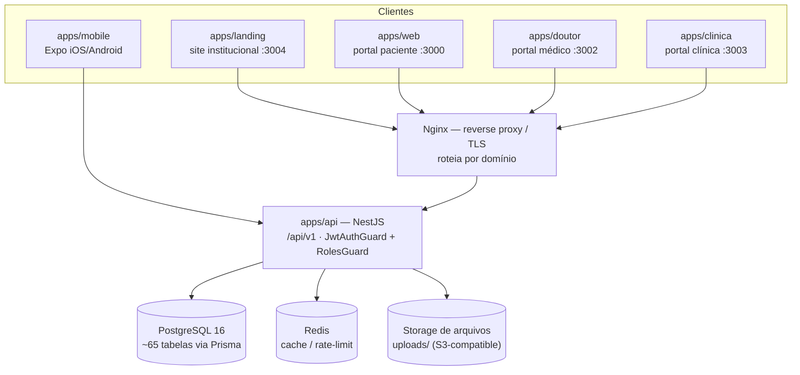
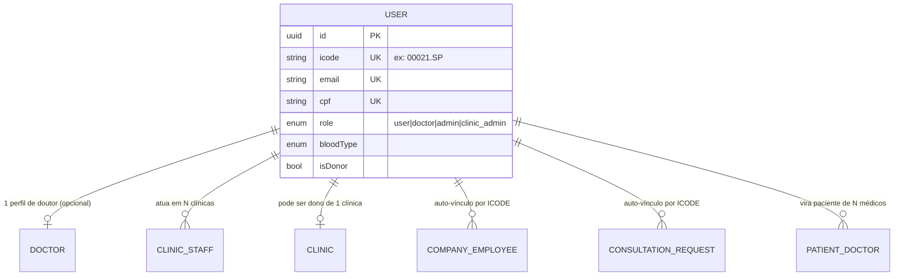
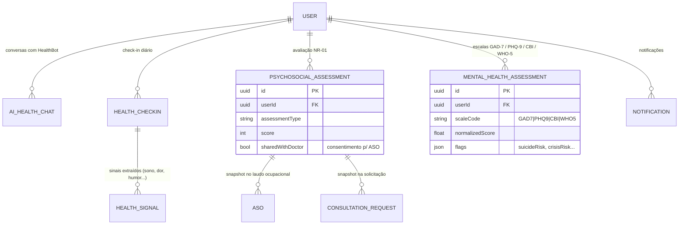

# iCODLIFE — Arquitetura e estrutura de dados

Documento de referência gerado a partir de `apps/api/prisma/schema.prisma` (fonte da verdade — qualquer
divergência futura deve ser resolvida a favor do schema). Este documento é uma visão **conceitual/lógica**:
mostra entidades, chaves e relações; não repete todas as ~30 colunas de cada tabela (isso o schema já faz
melhor). Os diagramas usam sintaxe **Mermaid** — abrem nativamente no GitHub, VS Code (extensão Mermaid),
Obsidian, Notion, ou em https://mermaid.live colando o bloco de código.

Veja também `ICODLIFE_Arquitetura_Alto_Nivel.svg` para a visão de infraestrutura (clientes → nginx → API → banco).

---

## 1. Visão geral da arquitetura



**Ideia central:** existe **um único banco de dados** e **uma única API**. Os quatro portais web (landing,
web, doutor, clinica) e o app mobile são só "janelas" diferentes para os mesmos dados — cada um enxerga um
recorte diferente (paciente vê o próprio prontuário; médico vê seus pacientes vinculados; clínica vê os
médicos, salas e guichês dela). Ninguém tem banco próprio.

---

## 2. Cadastro único (ICODE) — o fio que une tudo

A tabela `User` é a espinha dorsal do sistema. Paciente, médico e integrante de equipe de clínica **são
sempre o mesmo registro em `users`** — os perfis extras (`Doctor`, `ClinicStaff`) apenas **estendem** esse
usuário:



Por isso a busca "iCODLIFE" usada em Meus Funcionários, Base de Consultas e no guichê de atendimento
consulta sempre a mesma tabela `users` — evita cadastro duplicado entre os três portais.

---

## 3. Domínio: Prontuário do paciente

Tudo que alimenta a "linha do tempo de saúde" do paciente no `apps/web`.

```mermaid
erDiagram
  USER ||--o{ HEALTH_RECORD : "arquivos/exames"
  USER ||--o{ APPOINTMENT : "consultas agendadas"
  USER ||--o{ MEDICATION : "medicamentos"
  MEDICATION ||--o{ MEDICATION_LOG : "doses tomadas/puladas"
  USER ||--o{ EXAM_RESULT : "exames laboratoriais"
  EXAM_RESULT ||--o{ EXAM_RESULT_ITEM : "marcadores (glicose, colesterol...)"
  USER ||--o{ SURGERY : "cirurgias"
  USER ||--o{ FAMILY_MEMBER : "grupo familiar (owner)"
  FAMILY_MEMBER ||--o{ SURGERY : "cirurgia de dependente"
  USER ||--o{ VACCINATION_RECORD : "carteira de vacinação"
  VACCINE ||--o{ VACCINATION_RECORD : "catálogo de vacinas"
  USER ||--o{ BODY_METRIC : "evolução corporal"
  USER ||--o{ BLOOD_PRESSURE_READING : "pressão arterial"
  USER ||--o{ GLUCOSE_READING : "glicemia"
  USER ||--o{ HBA1C_READING : "hemoglobina glicada"
  USER ||--o{ MENSTRUAL_CYCLE : "ciclo menstrual"
  MENSTRUAL_CYCLE ||--o{ MENSTRUAL_DAILY_LOG : "registro diário"
  USER ||--o{ OPHTHALMOLOGY_EXAM : "exame oftalmológico (IA)"
  USER ||--o{ OPHTHALMOLOGY_HISTORY : "histórico oftalmo"
  USER ||--o| LIFESTYLE_PROFILE : "perfil de estilo de vida"
  USER ||--o{ LIFESTYLE_SNAPSHOT : "fotos do perfil no tempo"
  USER ||--o{ SHARE_TOKEN : "link de compartilhamento"

  HEALTH_RECORD {
    uuid id PK
    uuid userId FK
    string category
    string fileUrl
    bool isProcessed
  }
  EXAM_RESULT {
    uuid id PK
    uuid userId FK
    string examType
    string aiRiskLevel
  }
  MEDICATION {
    uuid id PK
    uuid userId FK
    string name
    bool isActive
    bool isContinuous
  }
```



---

## 4. Domínio: Saúde mental, sinais e IA



---

## 5. Domínio: Médico / consultório (`apps/doutor`)

```mermaid
erDiagram
  PLATFORM_PLAN ||--o{ DOCTOR : "plano assinado (gratuito/profissional)"
  USER ||--o| DOCTOR : "1 usuário : 1 perfil doutor"
  DOCTOR ||--o{ PATIENT_DOCTOR : "pacientes vinculados"
  DOCTOR ||--o{ DOCTOR_WORKING_HOURS : "grade de horários"
  DOCTOR ||--o{ DOCTOR_BLOCKED_SLOT : "bloqueios de agenda"
  DOCTOR ||--o{ DOCTOR_APPOINTMENT : "consultas na agenda"
  DOCTOR ||--o{ DOCTOR_PRESCRIPTION : "receitas emitidas"
  DOCTOR ||--o{ DOCTOR_EXAM_ORDER : "pedidos de exame"
  DOCTOR ||--o{ DOCTOR_STAFF : "equipe (assistentes)"
  DOCTOR ||--o{ DOCTOR_CASH_ENTRY : "lançamentos financeiros"
  DOCTOR ||--o{ CHAT_ROOM : "conversas com pacientes"
  DOCTOR ||--o{ TELEMEDICINE_ROOM : "salas de telemedicina (host)"
  DOCTOR ||--o{ COMPANY : "empresas clientes (medicina do trabalho)"
  DOCTOR ||--o{ ASO : "atestados emitidos"
  PATIENT_DOCTOR ||--o{ DOCTOR_APPOINTMENT : "consultas do vínculo"
  PATIENT_DOCTOR ||--o{ DOCTOR_PRESCRIPTION : "receitas do vínculo"
  PATIENT_DOCTOR ||--o{ DOCTOR_EXAM_ORDER : "exames do vínculo"
  PATIENT_DOCTOR ||--o{ ASO : "ASOs do vínculo"
  CHAT_ROOM ||--o{ CHAT_MESSAGE : "mensagens"

  DOCTOR {
    uuid id PK
    uuid userId FK UK
    string doctorId UK "DR.00001.SP"
    enum crmStatus "pending|verified|suspended|canceled"
    string[] specialties
    uuid platformPlanId FK
    enum platformPlanStatus "trial|pending_payment|active|canceled"
  }
  PATIENT_DOCTOR {
    uuid id PK
    uuid userId FK
    uuid doctorId FK "nullable — médico externo (ainda fora da plataforma)"
    enum status "pending|active|ended"
  }
```

---

## 6. Domínio: Clínica multi-tenant (`apps/clinica`)

```mermaid
erDiagram
  USER ||--o| CLINIC : "1 usuário dono : 1 clínica"
  CLINIC ||--o{ CLINIC_DOCTOR : "médicos associados"
  DOCTOR ||--o{ CLINIC_DOCTOR : "atua em N clínicas"
  CLINIC ||--o{ CLINIC_STAFF : "equipe administrativa"
  USER ||--o{ CLINIC_STAFF : "usuário atua como staff"
  CLINIC ||--o{ CLINIC_ROOM : "salas físicas"
  CLINIC_ROOM ||--o{ CLINIC_DOCTOR : "sala fixa do médico"
  CLINIC ||--o{ CLINIC_PROCEDURE : "catálogo de procedimentos"
  CLINIC ||--o{ CLINIC_EXAM_PRICE : "preço por tipo de exame"
  CLINIC ||--o{ DOCTOR_APPOINTMENT : "agenda usada na clínica"
  CLINIC ||--o{ DOCTOR_CASH_ENTRY : "financeiro da clínica"
  CLINIC ||--o{ CHAT_ROOM : "conversas na clínica"
  CLINIC ||--o{ COMPANY : "empresas atendidas pela clínica"
  CLINIC ||--o{ ASO : "ASOs emitidos na clínica"

  CLINIC {
    uuid id PK
    string clinicCode UK
    uuid ownerUserId FK UK
    string cnpj UK
  }
  CLINIC_DOCTOR {
    uuid id PK
    uuid clinicId FK
    uuid doctorId FK
    enum role "owner|associated|visiting"
    decimal commissionPct
  }
  CLINIC_EXAM_PRICE {
    uuid id PK
    uuid clinicId FK
    string examType UK "com clinicId"
    decimal price
  }
```

---

## 7. Domínio: Medicina do trabalho, atendimento por guichê e financeiro

O fluxo mais elaborado do sistema: empresa envia solicitação → vira fila → é atendida num guichê → gera
ASO → gera lançamento financeiro automático.

```mermaid
erDiagram
  DOCTOR ||--o{ COMPANY : "empresa cliente cadastrada pelo médico"
  CLINIC ||--o{ COMPANY : "empresa também vinculada à clínica (opcional)"
  COMPANY ||--o{ COMPANY_EMPLOYEE : "funcionários da empresa"
  USER ||--o{ COMPANY_EMPLOYEE : "auto-vínculo por ICODE"
  COMPANY ||--o{ CONSULTATION_REQUEST : "solicitações de exame (Base de Consultas)"
  COMPANY_EMPLOYEE ||--o{ CONSULTATION_REQUEST : "solicitação do funcionário"
  CONSULTATION_REQUEST ||--o{ SERVICE_SESSION : "atendimento(s) gerado(s)"
  CLINIC ||--o{ SERVICE_COUNTER : "guichês de atendimento"
  CLINIC_STAFF ||--o| SERVICE_COUNTER : "staff logado no guichê"
  SERVICE_COUNTER ||--o{ SERVICE_SESSION : "atendimentos no guichê"
  CLINIC_STAFF ||--o{ SERVICE_SESSION : "atendente responsável"
  SERVICE_SESSION ||--o| ASO : "ASO emitido no atendimento"
  DOCTOR ||--o{ ASO : "médico examinador"
  SERVICE_SESSION ||--o| DOCTOR_CASH_ENTRY : "cobrança automática (1:1)"
  SERVICE_COUNTER ||--o{ DOCTOR_CASH_ENTRY : "lançamentos do guichê"
  DOCTOR_APPOINTMENT ||--o{ DOCTOR_CASH_ENTRY : "lançamento de consulta"
  CLINIC_ROOM ||--o{ DOCTOR_CASH_ENTRY : "lançamento de sala"

  COMPANY_EMPLOYEE {
    uuid id PK
    uuid companyId FK
    uuid userId FK "nullable — auto-vínculo quando ICODE bate"
    string icode
  }
  CONSULTATION_REQUEST {
    uuid id PK
    uuid companyId FK
    uuid employeeId FK
    uuid userId FK "nullable"
    enum status "pending|linked|queued|in_service|completed|canceled"
  }
  SERVICE_SESSION {
    uuid id PK
    uuid counterId FK
    uuid staffId FK
    uuid consultationRequestId FK "nullable"
    uuid asoId FK "nullable"
    enum status "in_progress|completed|canceled"
  }
  DOCTOR_CASH_ENTRY {
    uuid id PK
    uuid doctorId FK
    uuid clinicId FK
    uuid counterId FK "nullable"
    uuid serviceSessionId FK UK "1:1 — evita cobrança duplicada"
    string examType
    decimal amount
  }
  ASO {
    uuid id PK
    uuid doctorId FK
    uuid companyId FK
    uuid clinicId FK
    uuid psychosocialAssessmentId FK "nullable"
    string examType "admissional|periodico|retorno|mudanca_funcao|demissional"
    string result "apto|apto_restricoes|inapto"
  }
```

---

## 8. Enums de referência

| Enum | Valores |
|---|---|
| `UserRole` | user · doctor · admin · clinic_admin |
| `CrmStatus` | pending · verified · suspended · canceled |
| `ClinicDoctorRole` | owner · associated · visiting |
| `ClinicStaffRole` | admin · reception · financeiro · nurse |
| `ConsultationRequestStatus` | pending · linked · queued · in_service · completed · canceled |
| `ServiceSessionStatus` | in_progress · completed · canceled |
| `PlatformPlanStatus` | trial · pending_payment · active · canceled |
| `AppointmentStatus` | scheduled · completed · canceled · no_show |
| `BloodType` | A+ · A- · B+ · B- · AB+ · AB- · O+ · O- · unknown |

---

## 9. Notas de manutenção

- **Fonte da verdade:** `apps/api/prisma/schema.prisma`. Qualquer mudança de schema exige migration manual
  (`apps/api/prisma/migrations/<timestamp>_<nome>/migration.sql`) — o ambiente de desenvolvimento atual não
  consegue rodar `prisma migrate dev/generate` diretamente (sem acesso de rede ao binário do Prisma).
- **Prisma Client** é gerado em `apps/api/src/generated/prisma` (caminho customizado) — depois de qualquer
  migration, rodar `npx prisma generate` e reiniciar o backend do zero (apagando `dist/`), senão o cliente
  gerado no `dist` fica desatualizado.
- Este documento cobre ~65 modelos agrupados por domínio de negócio. Para o schema completo (todas as
  colunas, índices e `@map`), sempre consultar o `.prisma` diretamente.
